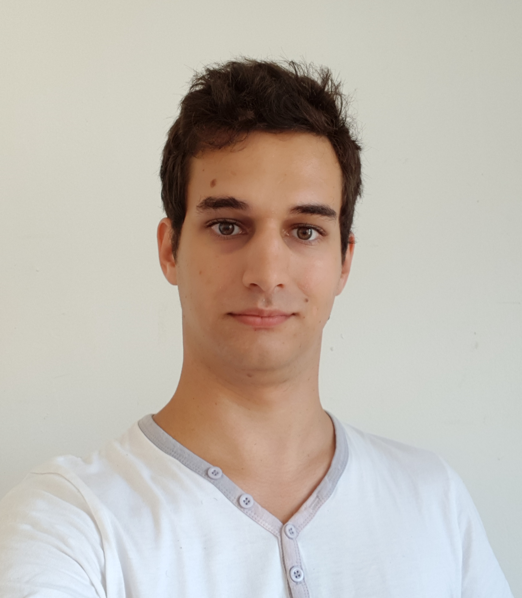
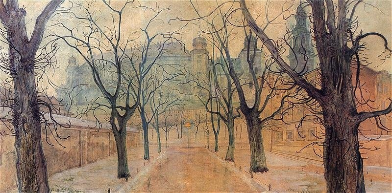
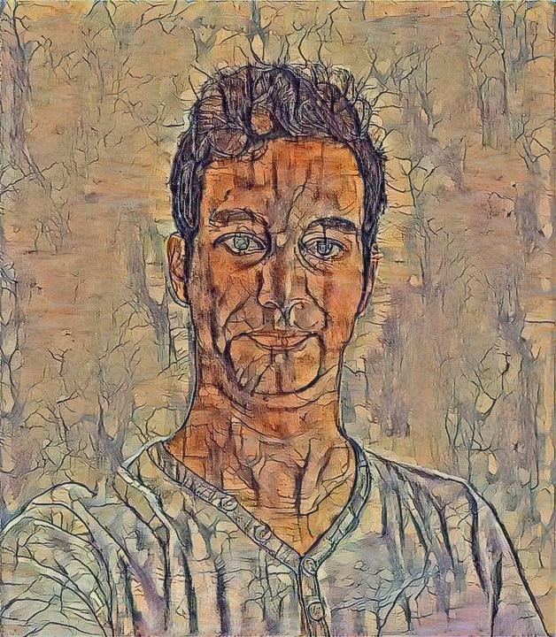

# An Algorithm Of Artistic Style

This is Yet Another reimplementation of the original algorithm of Neural
Artistic Style by Leon Gatys. However, this implementation has those nice
features:

- It's 100% Pytorch. No other dependencies for `style.py`. _Though you can install Vermeille/limpid for better and faster convergence_.
- It also implements the color preservation given in Controlling Perceptual
  Factors of Neural Artistic Style (still by Gatys)
- It embeds a web interface based on Flask. _However this is not production
  ready. The server will just not respond while a picture is being computed_.
  Just host it on your own cloud, and don't give the link to anyone :)

# Running it
As a webservice:

```
python3 style_server.py
```

As a command line tool:

`face.jpg`



`painting.png`



```
python3 style.py --content face.jpg --style painting.png --out out.jpg --size 720
```

`out.jpg`


